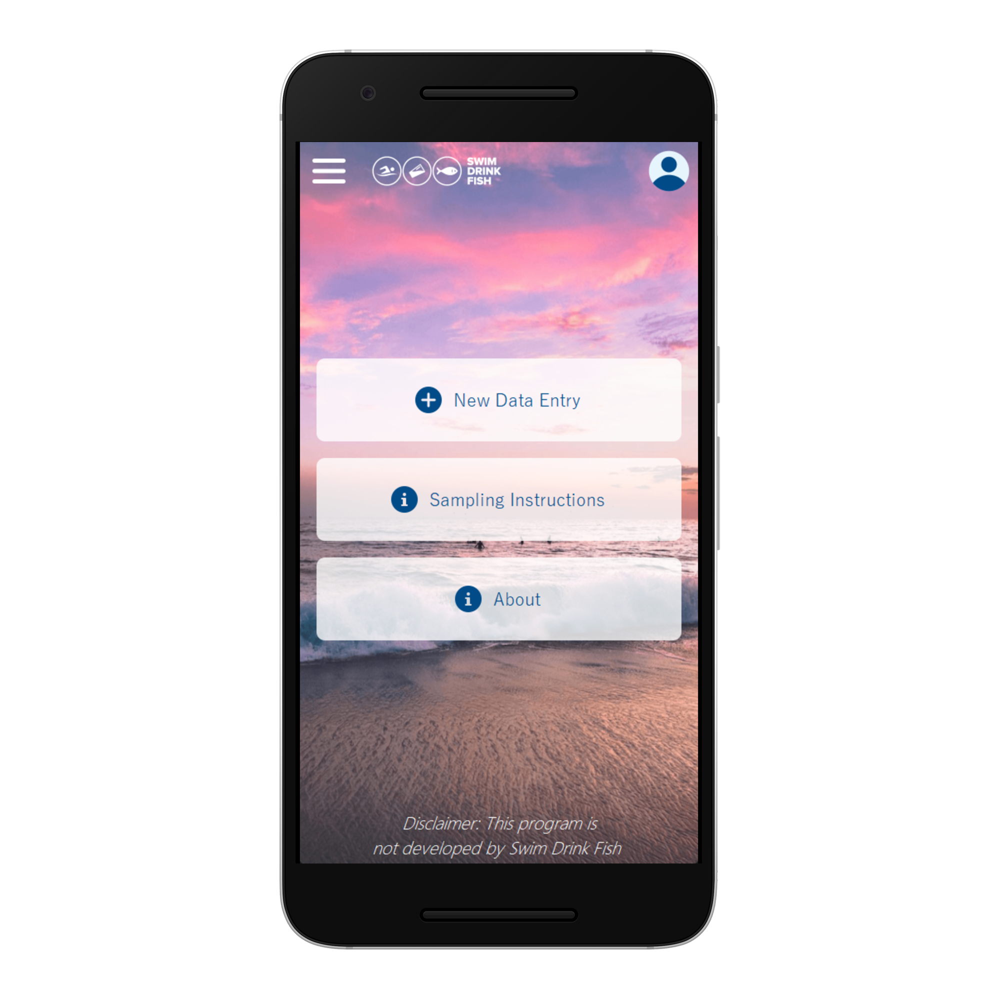
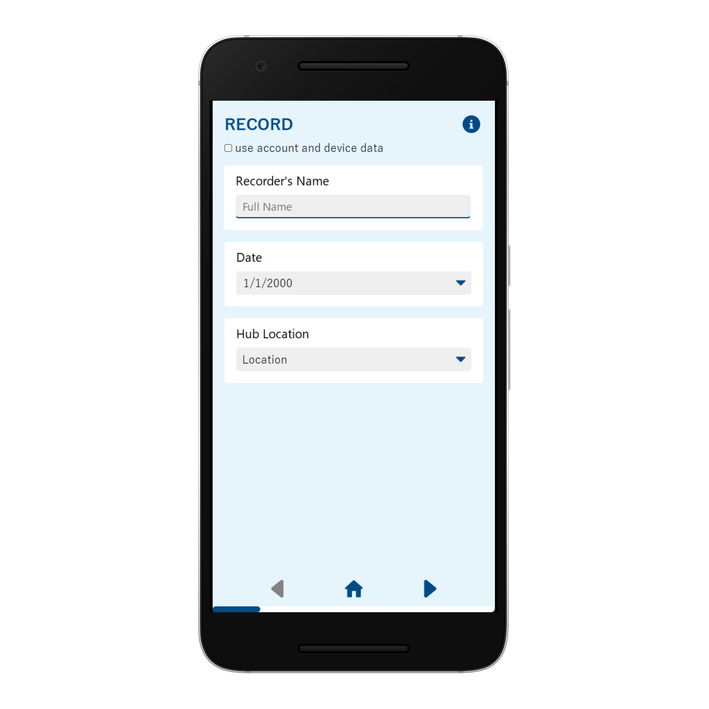
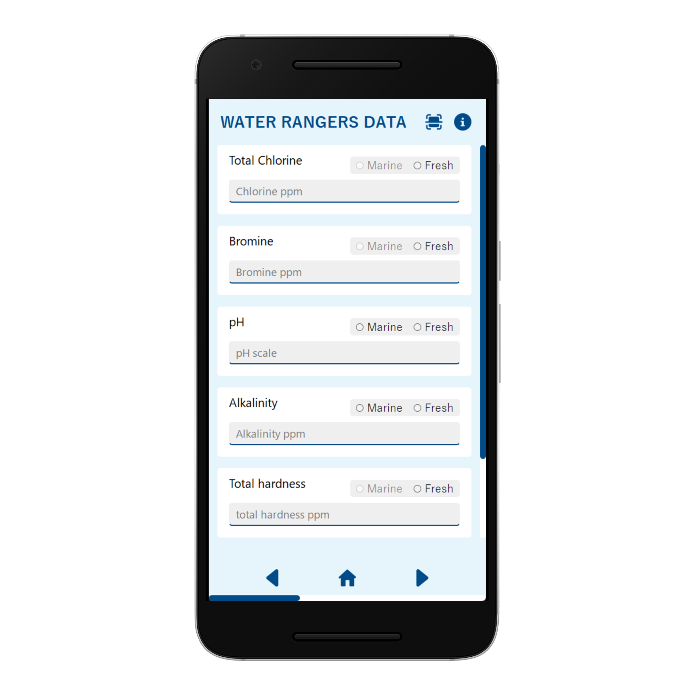
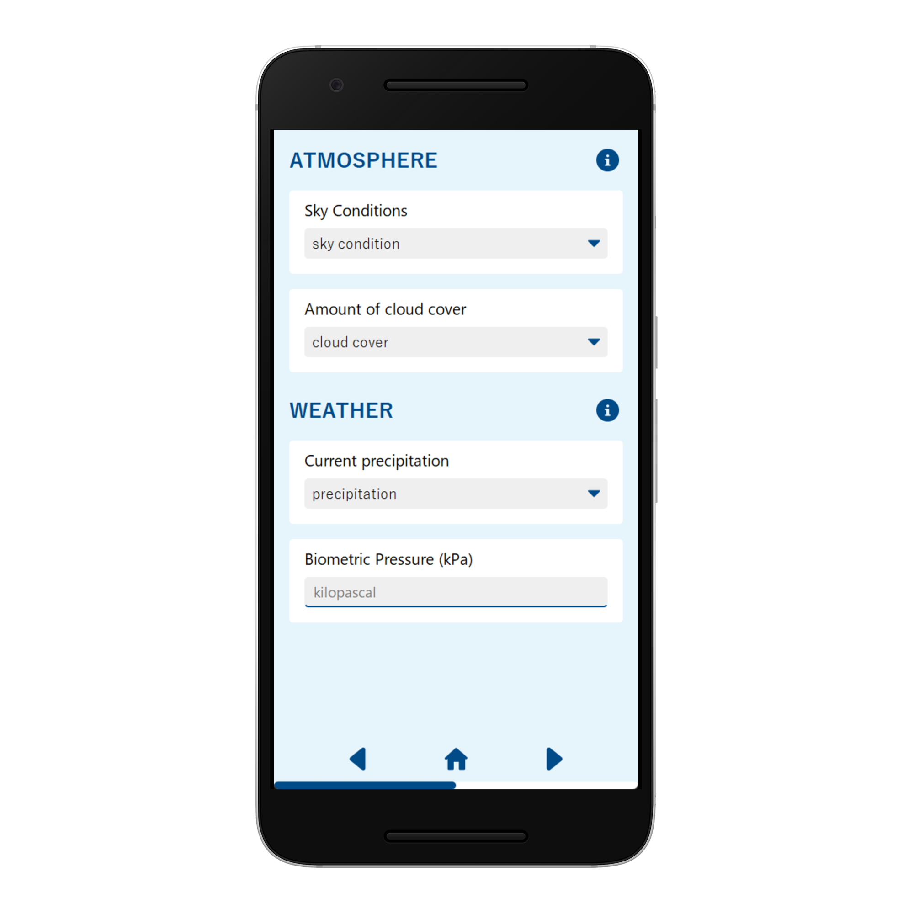
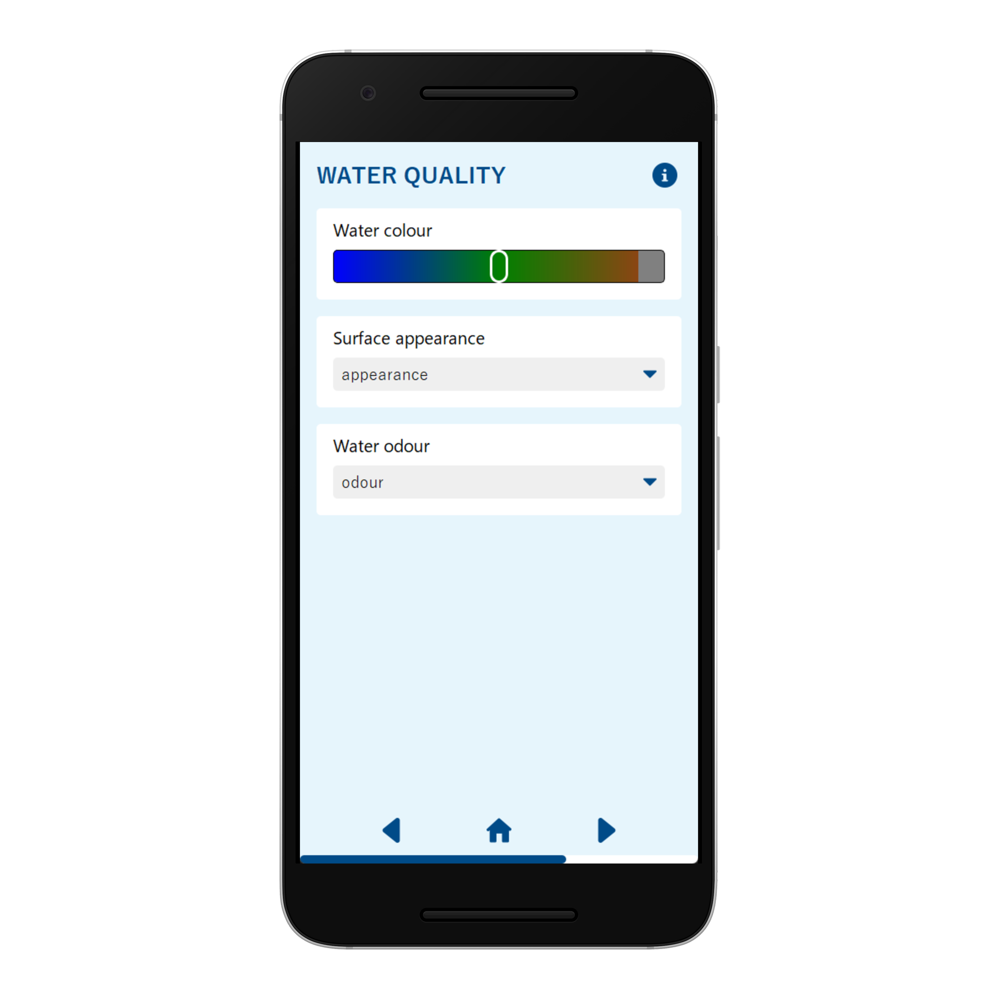
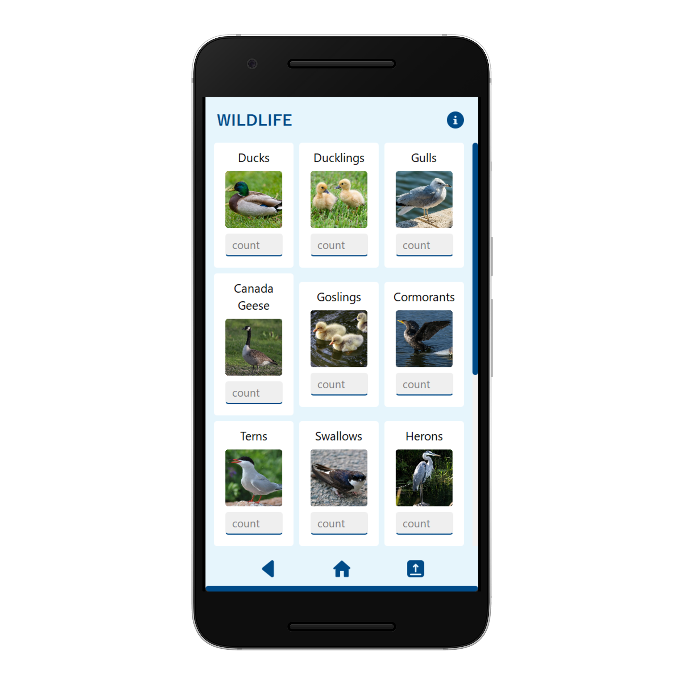
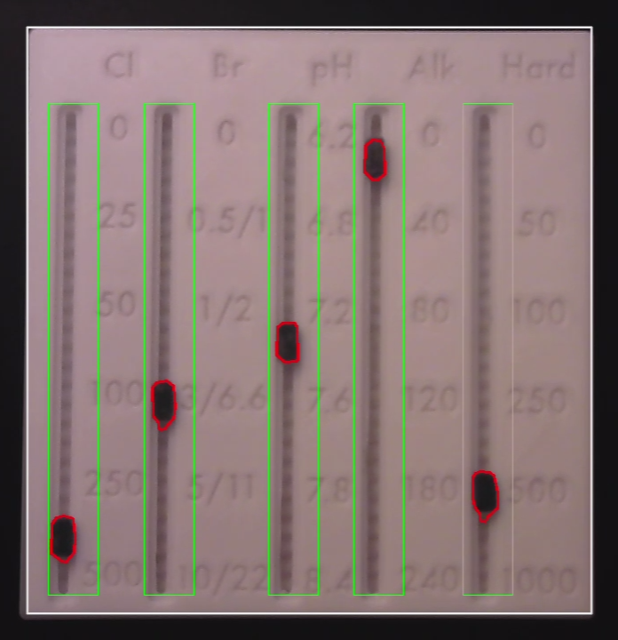
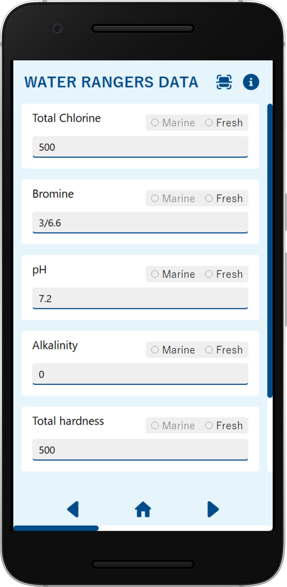
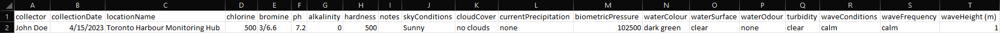

# SlidexCell

## Product Overview
The SlidexCell is a combined slider and app system designed for the [Swim Drink Fish (SDF)](https://www.swimdrinkfish.ca/) non-profit to collect environmental observations data with speed and ease across different weather conditions. It records and automatically uploads data to a spreadsheet database.

## Prototype Usage

### Main Menu
On the main page of the SlidexCell app, the user is presented with the option to edit their account, obtain information on SDF and the program, and, most notably, create a new data entry.

### Form
Creating a new data entry illustrates a first glance at the digital features that add extra functionality, rather than just completing the form similar to pen and paper. For example, the record fields can be auto-filled according to user and device data, and the info buttons next to each section provide information on sampling.

Progressing through the following screens, more data can be recorded using similar input items such as dropdown menus, text boxes, and radio buttons. Note the colour picker slider and the images for wildlife count, further demonstrating the potential of a digital design.

|  |  |  |
|:--:|:--:|:--:| 
|  |  |  |

### Scan
The slider set to the observed values can be scanned by pressing the scan pushbutton in the app and aligning the camera with the slider. Doing so results in the slider's fields being automatically digitized and inputted into the form.

The user can terminate the scan before completion by pressing **q**.

|  |  |  |
|:--:|:--:|:--:|
| *1. Scan pushbutton* | *2. Scanning of slider* | *3. Auto-filled form fields* |

### Submit
The entry can be submitted using the submit pushbutton located at the end of the form. Submitting the form generates a spreadsheet that includes all inputted data and is compatible with SDF’s database formatting.

|  
|:--:|
| *Submit pushbutton* |

|  |
|:--:|
| *Data snippet in generated spreadsheet* |

## Run

### Dependencies
[Python 3](https://www.python.org/downloads/)

[PyQt5](https://www.riverbankcomputing.com/software/pyqt/) used for the GUI.

    pip install PyQt5

[OpenCV](https://github.com/opencv/opencv-python) to scan the slider into values.

    pip install opencv-python

### Compile
Run the following terminal command in the src folder to generate the resource python module:

    pyrcc5 resources/res.qrc -o res.py

in the same terminal environment, to execute the Python file:

    python main.py

Alternatively, you can execute the [run.sh](../run.sh) script to compile and run the project.

## Credits
I, Nabeth Ghazi, developed and maintain the software and this repository.

Thanks to Taketsugu Kawashima and Angela Leung for preparing the presentation.

Thanks to Natalie Lim for her contributions to the [poster](poster.pdf) and [one-pager](one-pager.pdf) included in this repository.

Thanks to Youssef Saad for creating the slider CAD model and fabricating it.

## Acknowledgements
Special thanks to Megan Coad of SDF for collaborating with our team on SlidexCell.

Our team was awarded the [Ian and Shirley Rowe Innovation & Teamwork Award](https://engineering.calendar.utoronto.ca/scholarships-and-financial-aid):
> This award, established through a generous donation by Ian H. and Shirley Rowe, is given to a student team demonstrating values of innovation and teamwork, also exhibiting passion for community impact in undergraduate Praxis courses within the Division of Engineering Science.

[Mockup](../demo/README.md) photos generated using [Mockuphone](https://mockuphone.com/).

## License
[GNU General Public License Version 3](../LICENSE)
